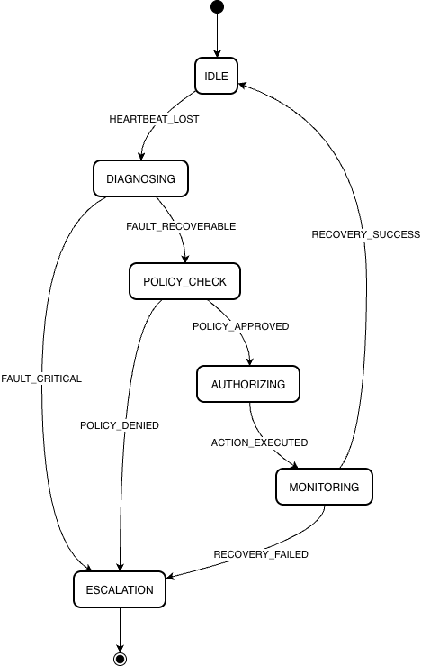

# Lab 3: Goals, Events, and Reactive Behavior

## Scenario Description
Autonomous IT Node Recovery (Technological Disaster)

## Agent Goals
**Guardian Goals:**
- Detect system failure
- Diagnose fault
- Check safety policy
- Authorize recovery

**Runner Goals:**
- Execute recovery action
- Report result
- Escalate if recovery fails

## Events
- HEARTBEAT_LOST
- FAULT_RECOVERABLE
- FAULT_CRITICAL
- POLICY_APPROVED
- POLICY_DENIED
- RECOVERY_SUCCESS
- RECOVERY_FAILED

## FSM Diagram

## Python Implementation
class GuardianFSM:
    def __init__(self):
        self.state = "IDLE"

    def trigger(self, event):
        print(f"\nEvent: {event}")
        print(f"Current State: {self.state}")

        if self.state == "IDLE":
            if event == "HEARTBEAT_LOST":
                self.state = "DIAGNOSING"

        elif self.state == "DIAGNOSING":
            if event == "FAULT_RECOVERABLE":
                self.state = "POLICY_CHECK"
            elif event == "FAULT_CRITICAL":
                self.state = "ESCALATION"

        elif self.state == "POLICY_CHECK":
            if event == "POLICY_APPROVED":
                self.state = "AUTHORIZING"
            else:
                self.state = "ESCALATION"

        elif self.state == "AUTHORIZING":
            if event == "ACTION_EXECUTED":
                self.state = "MONITORING"

        elif self.state == "MONITORING":
            if event == "RECOVERY_SUCCESS":
                self.state = "IDLE"
            else:
                self.state = "ESCALATION"

        print(f"New State: {self.state}")

#  Simulation  #

guardian = GuardianFSM()

guardian.trigger("HEARTBEAT_LOST")
guardian.trigger("FAULT_RECOVERABLE")
guardian.trigger("POLICY_APPROVED")
guardian.trigger("ACTION_EXECUTED")
guardian.trigger("RECOVERY_SUCCESS")

## Execution Trace

Event: HEARTBEAT_LOST
Current State: IDLE
New State: DIAGNOSING

Event: FAULT_RECOVERABLE
Current State: DIAGNOSING
New State: POLICY_CHECK

Event: POLICY_APPROVED
Current State: POLICY_CHECK
New State: AUTHORIZING

Event: ACTION_EXECUTED
Current State: AUTHORIZING
New State: MONITORING

Event: RECOVERY_SUCCESS
Current State: MONITORING
New State: IDLE

## 4. FSM Diagram

The FSM models the **Guardian agent’s reactive behavior**.  

### **States**
- **IDLE** – Waiting for failure events.  
- **DIAGNOSING** – Analyzing the fault type.  
- **POLICY_CHECK** – Verifying safety/policy constraints.  
- **AUTHORIZING** – Authorizing the Runner to act.  
- **MONITORING** – Monitoring the outcome of recovery.  
- **ESCALATION** – Human intervention required; system cannot recover automatically.  

### **Transitions**

| From State      | To State        | Trigger Event           |
|-----------------|----------------|------------------------|
| IDLE            | DIAGNOSING     | HEARTBEAT_LOST         |
| DIAGNOSING      | POLICY_CHECK   | FAULT_RECOVERABLE      |
| DIAGNOSING      | ESCALATION     | FAULT_CRITICAL         |
| POLICY_CHECK    | AUTHORIZING    | POLICY_APPROVED        |
| POLICY_CHECK    | ESCALATION     | POLICY_DENIED          |
| AUTHORIZING     | MONITORING     | ACTION_EXECUTED        |
| MONITORING      | IDLE           | RECOVERY_SUCCESS       |
| MONITORING      | ESCALATION     | RECOVERY_FAILED        |

### **Layout Description**
- **Horizontal main flow** from left to right:  
`IDLE → DIAGNOSING → POLICY_CHECK → AUTHORIZING → MONITORING → IDLE`  
- **ESCALATION** branches above or below from DIAGNOSING, POLICY_CHECK, and MONITORING.  
